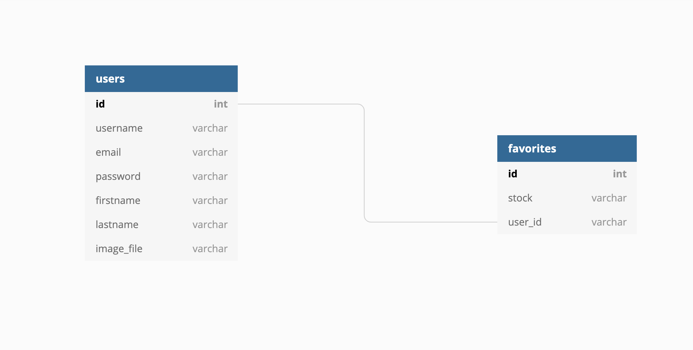

# Capstone1
Daily updated Stock Market Web Application

## Website Goal
The aim of this website is following stock market prices, currencies as well as crypto currencies.

## API Data
Data will be sourced from the Free version of Financial Modeling Prep API and Exchange Rate API.
Financial Modeling API has limit of requests which is 250 request by daily. 

### Database Schema

#### Technology Used:
* Python
* JavaScript
* Bootstrap
